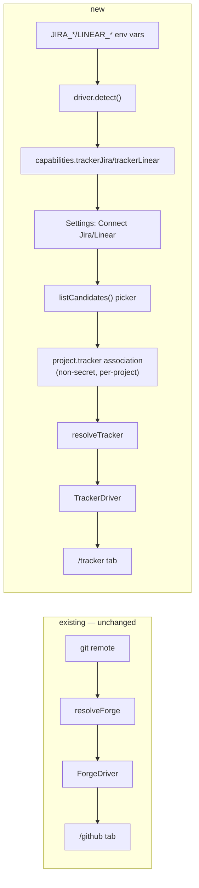

# Browse Jira and Linear tasks alongside GitHub

## 📝 TLDR
Today the cockpit's `/github` tab lets a user browse a project's GitHub issues/PRs and hand one to
an agent as a task — zero-config, derived entirely from the repo's git remote, authenticated by
delegating to the `gh` CLI (`GITHUB_TOKEN` as the env-var fallback). Teams whose backlog lives in
Jira or Linear instead of (or alongside) GitHub Issues get none of that today. This spec adds a
**read-only** browsing capability for Jira and Linear, delivered as one shared `TrackerDriver` seam
— modeled on the existing `ForgeDriver` pattern but narrower (no PRs, no merge state, no writes) —
with Jira shipping first and Linear second to prove the seam generalizes. Credentials are read from
env vars only, matching the `GITHUB_TOKEN` precedent; a project's Jira project / Linear team is
picked once from an auto-discovered list, not typed in blind. Future behavior — nothing below is
live yet.

**Decisions taken before this draft** (product-owner call, recorded here for traceability):
single spec/PR covering both providers behind one abstraction; read-only only (no comments, no
status transitions, no write-back); env-var-only credentials, no new stored-secret mechanism;
project/team association is picked from an API-fetched candidate list, not typed or inferred.

## 📝 Problem Statement
The cockpit's only issue-tracker surface is GitHub (`packages/cezar/src/server/forge/`, `/github`
route, `ForgeDriver` interface at `forge/types.ts:257-284`). A project whose tasks live in Jira or
Linear — common outside pure-GitHub-Issues shops — cannot browse or hand those tasks to an agent
without leaving the cockpit to copy-paste a description manually. `ForgeDriver` is intentionally
shaped around what `gh` gives a *code forge*: PR merge state, diffs, draft-PR creation, one driver
resolved per repo from its git remote host (`forge/index.ts:49,77-85`). None of that fits a pure
issue tracker that has no git relationship at all — widening `ForgeDriver` would mean piling
PR-only `?`-optionals onto an interface an issue-only driver can't implement, so this needs a new,
narrower, parallel seam rather than a bolt-on.

## 📝 Proposed Solution
Add a `TrackerDriver` interface, parallel to (not layered on) `ForgeDriver`, sharing its
quiet-degrade contract (`{available: false, reason}`, never a throw/5xx — `forge/types.ts:14-20`)
and its shape family (`detect`/`detectCached`/`listIssues`/`searchItems?`/`viewUrl` —
`forge/types.ts:257-284`), plus one addition neither forge needs: `listCandidates()`, because a
tracker's "which project/team" cannot be derived from the repo the way a forge's host can
(`forge/index.ts:25-45` parses the git remote; Jira/Linear have no such anchor). `jira` and `linear`
drivers sit behind it, selected per-project by an explicit, non-secret association
(`{kind, externalId, externalName}`) the user picks once from a list the driver fetches from the
vendor's own API — never typed blind, never guessed from commit messages.

Credentials follow the `GITHUB_TOKEN` precedent exactly: read from env vars
(`backend-detect.ts:152-162`'s pattern), never stored by cezar. `secret-redaction.ts:28-29`'s
`SECRET_NAME_RE` already matches `*_TOKEN`/`*_KEY` by name, so `JIRA_API_TOKEN` and
`LINEAR_API_KEY` are redacted from logs/transcripts with **zero new redaction code** — verified by
reading that pattern directly, not assumed.

**Alternatives considered:**
- **Widen `ForgeDriver` itself.** Rejected: it is explicitly scoped to code-forge concerns (PR
  merge state, diffs, draft-PR creation); an issue-only driver would either fail those methods at
  runtime or need them all marked optional, defeating the point of a typed interface.
- **A single merged feed blending GitHub + Jira + Linear items** (à la GitHub Projects' cross-repo
  board, or Linear's own "all trackers" view some competitors ship). Deferred, not built: it adds a
  normalization/de-dup layer and a "which source's item wins on conflict" question nothing in this
  ask requires. Two source-scoped tabs — the existing `/github`, a new `/tracker` — cost less and
  match what was asked for ("also przeglądać zadania z jira i linear", not "one unified backlog").
- **Two-way sync**, the shape of Linear's own native GitHub/GitLab integration (webhook-driven,
  bidirectional workflow-state mapping). Rejected per the read-only decision above — that
  integration's complexity (webhook endpoints, conflict resolution between two systems' state
  machines, write OAuth scopes) is precisely what a read-only, fetch-on-demand design avoids.
- **3-legged OAuth**, the flow Jira/Linear's own marketplace apps use. Rejected per the env-var
  decision — cezar has never implemented an OAuth redirect/callback surface or a refresh-token
  lifecycle anywhere; building one for a read-only feature is disproportionate. A long-lived API
  token in an env var has the same operational shape `GITHUB_TOKEN` already has today (manual
  rotation, no refresh flow).

**Unverified, flag for implementation:** Atlassian has been migrating JQL issue search off
`GET/POST /rest/api/3/search` onto `/rest/api/3/search/jql`; this session had no web access to
confirm the current state of that migration or today's exact Jira/Linear rate-limit ceilings.
Neither affects this spec's architecture (still read-only, still env-var auth, still the same
degrade contract) — only which literal endpoint/limit the Phase 1/4 driver code calls. Confirm
against current vendor docs before implementing those steps.

## 📝 Architecture



*Takeaway:* the tracker seam is additive and structurally independent of the forge seam — a
project can have a GitHub forge (code lives there) and a Jira or Linear tracker (tickets live
there) at the same time, or either alone, or neither. Nothing in `forge/` changes.

- `packages/cezar/src/server/tracker/types.ts` — `TrackerKind = 'jira' | 'linear'`, `TrackerDriver`,
  `TrackerItem`, `TrackerAvailability`, `TrackerCandidate` (mirrors `forge/types.ts`'s shape).
- `packages/cezar/src/server/tracker/jira.ts`, `.../linear.ts` — one driver file per vendor, same
  promise `ForgeDriver` already makes ("adding a forge = one new driver file behind `resolveForge`,
  no route or UI change" — `forge/types.ts:9`); adding a third tracker later is the same shape of
  change.
- `packages/cezar/src/server/tracker/index.ts` — `resolveTracker(association)`, the tracker
  equivalent of `resolveForge()`, but keyed by the project's stored association instead of a
  parsed remote.
- Server-wide credential detection feeds `capabilities.trackerJira`/`trackerLinear`
  (`packages/contract/src/health.ts`'s `capabilitiesSchema`, alongside `automations`/`dispatch`) —
  computed once, cheaply, like the existing capability booleans; never a live shell-out on the
  health path, matching `detectCached()`'s existing contract (`forge/types.ts:261-263`).

## 📝 Data Model
No database exists in this project (state is JSON/NDJSON/Markdown under `.ai/cezar/` and
`~/.cezar/` — `AGENTS.md:3`), and this feature doesn't add one: like GitHub issues, tracker items
are fetched live and short-cached in memory, never persisted as a synced copy.

**New contract types** (`packages/contract/src/tracker.ts`, one zod schema per shape, type
inferred — `AGENTS.md`'s API-shapes rule):

```ts
export const trackerKindSchema = z.enum(['jira', 'linear']);

export const trackerItemSchema = z.object({
  kind: z.literal('issue'),
  id: z.string(),          // "PROJ-123" (Jira) or Linear's own identifier, e.g. "ENG-42"
  title: z.string(),
  author: z.string(),
  createdAt: z.string(),
  labels: z.array(z.string()),
  body: z.string(),        // markdown; Jira's ADF description converted, capped like ForgeComment
  url: z.string(),
  status: z.string(),      // the vendor's own workflow-state label, NOT normalized across vendors
});

export const trackerCandidateSchema = z.object({
  id: z.string(),          // Jira project id/key, Linear team id
  name: z.string(),        // human label for the picker
});

export const trackerAssociationSchema = z.object({
  kind: trackerKindSchema,
  externalId: z.string(),
  externalName: z.string(), // cached display label, so the UI never has to re-fetch it
});
```

**Project registry addition** (`packages/cezar/src/workspace/config.ts`, alongside the existing
`maxParallel`/`tags` per-project fields — `AGENTS.md`'s registry entry): `tracker?:
TrackerAssociation | null`, optional with `.catch(undefined)` per the registry's existing
salvage rule, so a bad or old entry never evicts the project row. One association per project in
this spec (a project maps to at most one non-GitHub tracker) — supporting more than one
simultaneously is explicitly deferred (see Non-goals below); `null` clears it, matching the
existing `maxParallel`/`tags` clear-with-`null` convention (`BACKWARD_COMPATIBILITY.md`'s
`PATCH /api/v1/projects/:projectId` entry).

**Non-goals:**
- No per-issue persisted record, no sync/mirror table — same as GitHub today.
- No multi-tracker-per-project (Jira *and* Linear on the same repo simultaneously) in this spec;
  the schema's `tracker?: TrackerAssociation | null` is singular by design, revisit only if asked.
- Sensitive data: ticket titles/bodies flow through the cockpit and, via "hand to agent", into an
  agent's prompt — the exact same exposure shape GitHub issue bodies already have today
  (`ForgeItem.body`), not a new class of risk. No field here is treated as more sensitive than a
  GitHub issue body is already treated.

## 📝 API Contracts
Dual-mounted per the existing project-scoped convention (`/api/v1/<path>` for the boot project,
`/api/v1/p/:projectId/<path>` for others — `route-parity.test.ts`'s rule), validated through the
Zod trio (`jsonZodValidator`/`paramZodValidator`/`queryZodValidator`), and added to
`BACKWARD_COMPATIBILITY.md` §2 in the same commit (`bc-route-inventory.test.ts` enforces this).

| Route | Shape | Notes |
| --- | --- | --- |
| `GET /api/v1/tracker/candidates?kind=jira\|linear` | `{available, candidates: TrackerCandidate[], reason?}` | Workspace-level (credential is process-wide, like `GITHUB_TOKEN`); powers the Settings picker. `kind` required, 400 on anything else. |
| `PATCH /api/v1/projects/:projectId` | body adds `tracker?: TrackerAssociation \| null` | Additive, per-key like the existing `maxParallel`/`tags` fields — an old `{maxParallel}`-only body means exactly what it always did. |
| `GET /api/v1/tracker` (+ `/p/:projectId/tracker`) | `{available, items: TrackerItem[], reason?}` | Mirrors `GET /api/v1/github`'s shape family exactly, including how it degrades: a project with no `tracker` association answers `200 {available: false, reason: 'no tracker configured for this project'}`, the same 200-with-`available:false` shape a vendor-side failure uses — matching the existing convention that read routes never turn "not configured" into a 4xx (`server.ts:5335`'s `prMergeState` fallback is the precedent; 409 is reserved for action routes with no underlying capability, e.g. `mergePR`, `server.ts:5349`). |
| `GET /api/v1/tracker/search?q=<text>&limit=<n>` | `{available, items: TrackerItem[], truncated?, reason?}` | Mirrors `/api/v1/github/search` (`q` 1–256 chars required, `limit` capped, 400 on malformed input). |

**Health/capabilities additions** (`packages/contract/src/health.ts`):
`capabilitiesSchema.trackerJira` / `.trackerLinear: boolean` (env-credential detected, mirrors
`automations`), and the projects-list shape gains an optional per-project `tracker?: {kind,
available, reason?}` (mirrors the existing `forge?` field — omitted for a project with no
association, so an old consumer that ignores it sees no change).

## 📝 UI/UX
- **Settings (per-project):** a "Connect Jira" / "Connect Linear" affordance appears only when the
  matching `capabilities.trackerJira`/`trackerLinear` is true (env credential detected) — otherwise
  absent, same zero-config discovery rule the GitHub tab already follows for `forge`. Clicking it
  calls `GET /tracker/candidates`, shows a searchable picker of the returned projects/teams, and on
  selection calls `PATCH /projects/:id` with the chosen `{kind, externalId, externalName}`. A
  "Disconnect" action sets it back to `null`.
- **Nav + route:** a new `/tracker` route/tab, gated like the GitHub nav item is gated on `forge`
  today (`nav-items.ts:48,81-86`) — here gated on the current project's `tracker` association being
  non-null *and* available. Label reflects the connected vendor ("Jira" / "Linear"), not a generic
  "Tracker", since a project has at most one.
- **List + filter + detail:** reuses the GitHub tab's proven interaction shape — free-text query +
  label filter (`github-filter.ts`'s `filterGithubItems`/`allLabels`, generalized to operate on
  `TrackerItem[]`), a detail route (mirrors `/github/issues/:n`), and the same
  local-miss-triggers-vendor-search fallback (`shouldSearchForge`'s rule, ported unchanged: a
  non-empty query with zero local matches asks the vendor's search endpoint). No PR-only chips
  (draft/checks/additions/deletions) — tracker items are always `kind: 'issue'`.
- **Hand-to-agent:** the existing composer flow (`github-task.ts`'s `githubTaskRef` /
  `composeGithubTask` / `githubRunBody`) is generalized to accept either a `ForgeItem` or a
  `TrackerItem` (same fields it already reads: id/title/url/body), so dragging a Jira or Linear
  item into the composer works exactly like dragging a GitHub issue does today — no persisted
  "link" record, same regex-based reference recovery (`task-refs.ts`) it already relies on.

## 📝 Edge Cases & Failure Scenarios
- **No env credential set:** feature entirely absent — no nav item, no Settings affordance, no
  route. Zero-config satisfied by construction.
- **Credential present but invalid (401/403):** `detect()` returns `{available: false, reason}`;
  `capabilities.trackerJira/trackerLinear` stays `true` (credential is *configured*, just not
  *working*) so the Settings affordance still appears but the candidates call and any connected
  project's list surface the reason inline — never a crash, never a 5xx.
  `capabilities.trackerJira`/`trackerLinear` therefore means "env var is set", not "env var works";
  worth a one-line doc note so a future reader doesn't conflate the two.
- **Credential present, no project association yet:** Settings shows "Connect", but no `/tracker`
  tab until a project/team is picked — matches "not yet configured" rather than "broken".
- **Association points at a project/team that later disappears** (deleted/renamed upstream, or the
  token loses access): list/search degrade to `{available: false, reason}`; the tab shows the same
  quiet-degrade banner GitHub already uses, never a stale cached list presented as current.
- **Rate limiting (429):** both drivers use the same short in-memory TTL cache pattern as
  `fetchGithub()` (`forge/github.ts:379-388`, 60s); a 429 is translated to `{available: false,
  reason: 'rate limited by <vendor>, retry shortly'}` rather than retried inline (no user-facing
  retry loop, matching the existing degrade contract).
- **Large description bodies:** Jira's description is Atlassian Document Format (rich JSON), not
  markdown — the driver converts it before filling `body`, capped at the same 8 000-char limit
  `ForgeComment` already uses (`forge/types.ts:51`). Linear's description is already markdown.
- **CI/tests without real credentials:** `CEZ_DRY_RUN=1` fakes driver responses, mirroring how
  `forge/github.ts` fakes PR data today — no test needs a live Jira/Linear account.

## 📝 Risks & Impact Review
- **Additive, no breaking change to any existing contract.** `ForgeDriver`, `/github*` routes and
  `ForgeItem` are untouched; every new field (`capabilities.trackerJira/trackerLinear`, the
  projects-list `tracker?`, the project registry's `tracker?`) is optional and defaults to absent.
- **New public routes must land in `BACKWARD_COMPATIBILITY.md` §2 in the same PR** —
  `bc-route-inventory.test.ts` fails otherwise; this is process, not a design risk, but it's easy to
  forget and is called out here so Phase 2's steps don't ship without it.
- **Zero-config tension, resolved, not ignored:** `AGENTS.md`'s "Zero config" section says a feature
  needing configuration is a design smell unless it's explicitly opt-in behind exposure/cost. This
  feature genuinely cannot be zero-config the way GitHub's forge is (no git-remote anchor exists for
  a Jira project or Linear team) — the resolution is the same shape as the `CEZ_AUTOMATIONS`/
  `CEZ_DISPATCH` exceptions already on record: **absent by default, discovered the moment its env
  var appears, and every step after that is a pick-from-a-list rather than typed config** — no
  free-text project key, no risk of a typo silently pointing at the wrong Jira project.
- **Shared credential across projects:** the env var is process-wide (like `GITHUB_TOKEN` already
  is), so every project on one cezar server instance that picks a tracker shares the same Jira/
  Linear identity. This is an existing pattern, not a new risk class, but worth naming: it means
  per-project access control is whatever the underlying Jira/Linear token already grants, not
  something cezar adds or narrows.
- **Rollback:** fully reversible without a migration — unset the env var (feature disappears) or
  clear a project's `tracker` field to `null` (that project's tab disappears); no persisted issue
  data exists to clean up.
- **Vendor API drift:** the search-endpoint and rate-limit specifics flagged "Unverified" above are
  the concrete implementation risk this spec can't close from a design pass alone — track it as a
  verification task in Phase 1/4, not a spec blocker.

## 📋 Phasing
- **Phase 1 — Jira driver, no routes/UI yet.** Proves the `TrackerDriver` seam against a real
  vendor without touching anything user-visible.
- **Phase 2 — Jira routes + project association.** API-testable end to end; still no cockpit UI.
- **Phase 3 — Jira cockpit UI.** Ships the user-visible feature for Jira.
- **Phase 4 — Linear.** Adds the second driver behind the now-proven seam; UI/routes from Phase
  2–3 extend rather than duplicate.

Each phase leaves the app fully working for every existing user; nothing is user-visible until
Phase 3 ships, and Phase 4 adds a second option to a picker that already works.

## 📋 Implementation Plan

**Phase 1 — `TrackerDriver` seam + Jira driver**
1. Add `packages/contract/src/tracker.ts`: `trackerKindSchema`, `trackerItemSchema`,
   `trackerCandidateSchema`, `trackerAssociationSchema` (as drafted above). Test: contract-parity
   fixture round-trips each schema.
2. Add `packages/cezar/src/server/tracker/types.ts`: `TrackerKind`, `TrackerAvailability`,
   `TrackerDriver` interface (`detect`, `detectCached`, `listIssues`, `searchItems?`,
   `listCandidates`, `viewUrl`). Test: type-only, covered by downstream driver tests.
3. Implement `packages/cezar/src/server/tracker/jira.ts`: env detection
   (`JIRA_BASE_URL`/`JIRA_EMAIL`/`JIRA_API_TOKEN`), HTTP Basic client, `detect()` via an
   authenticated identity probe, `listCandidates()` via Jira's project-search endpoint,
   `listIssues()`/`searchItems()` via JQL, ADF→markdown body conversion capped at 8 000 chars, 60s
   in-memory cache. Test: mocked 200/401/404/429 fixtures; `CEZ_DRY_RUN=1` fixture.
4. Add a regression test confirming `JIRA_API_TOKEN` is redacted by the existing
   `SECRET_NAME_RE`/`TOKEN_PATTERNS` with no code change to `secret-redaction.ts`. Leaves the app
   building and every existing test green; nothing new is reachable yet.

**Phase 2 — Jira routes + association**
5. Add `tracker?: TrackerAssociation | null` to the project registry schema
   (`workspace/config.ts`), optional with `.catch`, written through `mergeWriteWorkspaceConfig`.
   Extend `PATCH /api/v1/projects/:projectId` to accept it per-key. Test: registry
   round-trip, per-entry salvage on a corrupt `tracker` value.
6. Add `capabilities.trackerJira` to `capabilitiesSchema`; wire server-wide env detection at boot.
   Test: capabilities payload reflects env presence.
7. Add `GET /api/v1/tracker/candidates`, `GET /api/v1/tracker`, `GET /api/v1/tracker/search`,
   dual-mounted under `/api/v1/p/:projectId/tracker*`. Test: `route-parity.test.ts` coverage,
   `bc-route-inventory.test.ts` updated, `typed-bodies.test.ts` coverage for the new routes.
8. Update `BACKWARD_COMPATIBILITY.md` §2 with the new routes in the same commit. App still shows
   no new UI; the feature is now fully exercisable via API/integration tests.

**Phase 3 — Jira cockpit UI**
9. Settings: "Connect Jira" affordance gated on `capabilities.trackerJira`; candidate picker;
   PATCH on selection; "Disconnect" clears it. Test: component test for gated visibility and the
   connect/disconnect round trip.
10. Nav item + `/tracker` (+ `/tracker/:id`) route, gated on the current project's `tracker`
    association; generalize `github-filter.ts`'s filter helpers to `TrackerItem[]`. Test: nav
    gating unit test (mirrors `nav-items.test.ts`), filter unit tests.
11. Generalize the hand-to-agent composer helpers (`github-task.ts`) to accept a `TrackerItem`.
    Test: composer test asserting a dragged Jira item produces the same prompt shape a GitHub issue
    does. Jira browsing is fully shippable here.

**Phase 4 — Linear**
12. Implement `packages/cezar/src/server/tracker/linear.ts`: `LINEAR_API_KEY` env detection,
    GraphQL client, `detect()`/`listCandidates()` (teams)/`listIssues()`/`searchItems()`. Test:
    mocked GraphQL fixtures (200/401/429), `CEZ_DRY_RUN=1` fixture.
13. Add `capabilities.trackerLinear`; extend `kind` handling in the Phase 2 routes and the Phase 3
    picker to offer Linear alongside Jira when both are detected. Test: picker shows both options
    when both env credentials are present, one when only one is.
14. Full regression pass: a project with a Jira association and a project with a Linear association
    both browse and hand-to-agent correctly in the same cockpit session.
